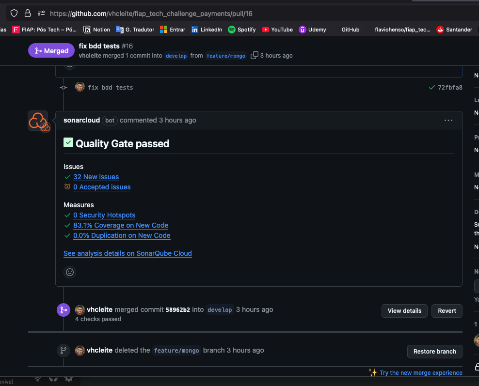

# API Pagamentos

- Criação de pagamentos
- Recebimento de callback de pagamento
- Consulta de estado de pagamento

### Banco de dados:

DocumentDb

Link de
uma [verificação de cobertura](https://github.com/vhcleite/fiap_tech_challenge_payments/actions/runs/12192076927).

Imagem de verificação de cobertura no repositório:

